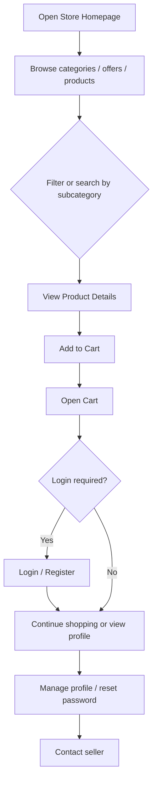

# E-Commerce Store

A Django-based e-commerce web application for browsing products, filtering by category, adding items to a cart, registering/login users, managing profiles, and contacting the store.

This project is built with Django and includes social authentication, Cloudinary media storage, CKEditor for product descriptions, and a session-based shopping cart.

## Features

- Product listing with category and subcategory filtering
- Offer banner section on the homepage
- Product detail page with reviews and ratings
- Session-based cart management
- User registration and login
- Password reset flow
- Google sign-in support via social authentication
- Profile management for users
- Contact form and about page
- Admin dashboard via Django admin and Jazzmin

## Tech Stack

- Python 3.x
- Django 6.1
- SQLite database
- Bootstrap-based frontend templates
- Cloudinary for media uploads
- django-ckeditor-5 for rich text product descriptions
- Django allauth + social-auth-app-django
- django-jazzmin for admin UI

## Project Flow

### Customer Journey



### App Flow Summary

1. User visits the homepage and sees featured offers and product listings.
2. They can filter categories and subcategories to narrow the product list.
3. Clicking a product opens the product detail page where they can see description, variants, related products, and reviews.
4. Products can be added to the cart using session-based cart logic.
5. Logged-in users can manage profile settings, update password, and access dashboard features.
6. Users can contact the store through the contact form.
7. Admin users can manage categories, products, offers, reviews, and contacts from the Django admin panel.

## Project Structure

```text
.
├── LICENSE
├── shop/
│   ├── manage.py
│   ├── requirements.txt
│   ├── db.sqlite3
│   ├── accounts/
│   │   ├── models.py
│   │   ├── views.py
│   │   ├── urls.py
│   │   ├── form.py
│   │   └── pipeline.py
│   ├── main/
│   │   ├── models.py
│   │   ├── views.py
│   │   ├── urls.py
│   │   ├── form.py
│   │   └── templates/
│   ├── shop/
│   │   ├── settings.py
│   │   ├── urls.py
│   │   └── wsgi.py
│   ├── static/
│   ├── templates/
│   └── media/
└── README.md
```

## Main Modules

### 1. `main` app

Handles storefront features such as:

- homepage
- product listing
- category filtering
- product detail
- cart actions
- contact page
- about page

Key routes:

- `/` — home page
- `/contact/` — contact page
- `/about/` — about page
- `/product_detail/<id>/` — product details
- `/cart/cart-detail/` — cart summary

### 2. `accounts` app

Handles authentication and user management:

- registration
- login/logout
- password reset
- profile dashboard
- profile updates
- social login integration

Key routes:

- `/account/log_in/` — login
- `/account/register/` — registration
- `/account/profile/` — profile settings
- `/account/profile_dashboard/` — dashboard
- `/account/password_reset/` — password reset

## Environment Variables

Create a `.env` file in the project root (inside the `shop` folder depending on your setup) with values similar to the following:

```env
SECRET_KEY=your-secret-key
DEBUG=True
ALLOWED_HOSTS=localhost,127.0.0.1
EMAIL_HOST_USER=your-email@gmail.com
EMAIL_HOST_PASSWORD=your-app-password
cloud_name=your-cloudinary-cloud-name
api_key=your-cloudinary-api-key
api_secret=your-cloudinary-api-secret
secure=True
SOCIAL_AUTH_URL_NAMESPACE=social
SOCIAL_AUTH_GOOGLE_OAUTH2_KEY=your-google-client-id
SOCIAL_AUTH_GOOGLE_OAUTH2_SECRET=your-google-client-secret
```

> The app loads these values from `python-decouple` in the Django settings file.

## Installation

1. Clone the repository:

```bash
git clone https://github.com/sujanlama90/ecommerce-project.git
cd e-commerce
```

2. Create and activate a virtual environment:

```bash
python3 -m venv venv
source venv/bin/activate
```

3. Install dependencies:

```bash
pip install -r shop/requirements.txt
```

4. Create your `.env` file and add the required settings.

5. Run database migrations:

```bash
cd shop
python manage.py migrate
```

6. Start the development server:

```bash
python manage.py runserver
```

7. Open the app in your browser:

```text
http://127.0.0.1:8000/
```

## Admin Access

Create a superuser to access the admin dashboard:

```bash
python manage.py createsuperuser
```

Then open:

```text
http://127.0.0.1:8000/admin/
```

## How the Application Works

### Homepage

The homepage loads products and categories from the database and shows:

- featured offers
- category blocks
- product card grid
- filter options by subcategory and price range

### Product Detail

The product detail page displays:

- product image and description
- price and discount details
- size and color variants
- reviews and rating summary
- related products

### Cart

Cart items are managed in the session and can be:

- added
- removed
- incremented
- decremented
- cleared

### User Accounts

Users can:

- register a new account
- log in and stay signed in depending on the remember-me option
- update their profile
- change their password
- reset password using email-based recovery

## Future Enhancements

- Checkout and order placement flow
- Payment integration
- Wishlist and saved items
- Coupon and discount system
- Admin product analytics
- Inventory management dashboard
- Search by product name and tags

## License

This project is licensed under the MIT License. See the [LICENSE](LICENSE) file for details.

## Notes

This project is a solid Django storefront foundation and is especially suitable for learning e-commerce architecture, Django ORM, session cart logic, and custom user authentication.
